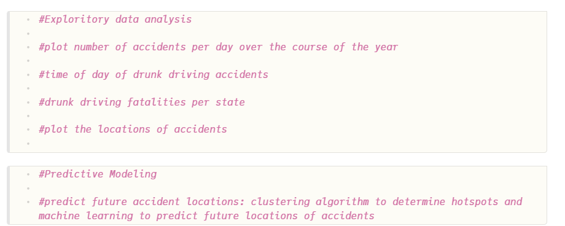

`Heading 1`'s are recommended to be reserved for the title of the manuscript.

`Heading 2`'s are recommended for broad sections such as *Abstract*, *Methods*, *Conclusion*, etc.

`Heading 3`'s and `Heading 4`'s are recommended for sub-sections.

## Links

Bare URL link: <https://manubot.org>

[Long link with lots of words and stuff and junk and bleep and blah and stuff and other stuff and more stuff yeah](https://manubot.org)

[Link with text](https://manubot.org)

[Link with hover text](https://manubot.org "Manubot Homepage")

[Link by reference][manubot homepage]

[Manubot Homepage]: https://manubot.org

## Citations

Citation by DOI [@doi:10.7554/eLife.32822].

Citation by PubMed Central ID [@pmc:PMC6103790].

Citation by PubMed ID [@pubmed:30718888].

Citation by Wikidata ID [@wikidata:Q56458321].

Citation by ISBN [@isbn:9780262517638].

Citation by URL [@{https://greenelab.github.io/meta-review/}].

Citation by alias [@deep-review].

Multiple citations can be put inside the same set of brackets [@doi:10.7554/eLife.32822; @deep-review; @isbn:9780262517638].
Manubot plugins provide easier, more convenient visualization of and navigation between citations [@doi:10.1371/journal.pcbi.1007128; @pubmed:30718888; @pmc:PMC6103790; @deep-review].

Citation tags (i.e. aliases) can be defined in their own paragraphs using Markdown's reference link syntax:

[@deep-review]: doi:10.1098/rsif.2017.0387

## Referencing figures, tables, equations

Figure @fig:square-image

Figure @fig:wide-image

Figure @fig:tall-image

Figure @fig:vector-image

Table @tbl:bowling-scores

Equation @eq:regular-equation

Equation @eq:long-equation

## Quotes and code

> Quoted text

> Quoted block of text
>
> Two roads diverged in a wood, and I—  
> I took the one less traveled by,  
> And that has made all the difference.

Code `in the middle` of normal text, aka `inline code`.

Code block with Python syntax highlighting:

```python
from manubot.cite.doi import expand_short_doi

def test_expand_short_doi():
    doi = expand_short_doi("10/c3bp")
    # a string too long to fit within page:
    assert doi == "10.25313/2524-2695-2018-3-vliyanie-enhansera-copia-i-insulyatora-gypsy-na-sintez-ernk-modifikatsii-hromatina-i-svyazyvanie-insulyatornyh-belkov-vtransfetsirovannyh-geneticheskih-konstruktsiyah"
```

Code block with no syntax highlighting:

```
Exporting HTML manuscript
Exporting DOCX manuscript
Exporting PDF manuscript
```

## Figures

{#fig:square-image}

{#fig:wide-image}

{#fig:tall-image height=3in}

{#fig:vector-image height=2.5in .white}

## Tables

| *Bowling Scores* | Jane          | John          | Alice         | Bob           |
|:-----------------|:-------------:|:-------------:|:-------------:|:-------------:|
| Game 1 | 150 | 187 | 210 | 105 |
| Game 2 |  98 | 202 | 197 | 102 |
| Game 3 | 123 | 180 | 238 | 134 |

Table: A table with a top caption and specified relative column widths.
{#tbl:bowling-scores}

|         | Digits 1-33                        | Digits 34-66                      | Digits 67-99                      | Ref.                                                        |
|:--------|:-----------------------------------|:----------------------------------|:----------------------------------|:------------------------------------------------------------|
| pi      | 3.14159265358979323846264338327950 | 288419716939937510582097494459230 | 781640628620899862803482534211706 | [`piday.org`](https://www.piday.org/million/)               |
| e       | 2.71828182845904523536028747135266 | 249775724709369995957496696762772 | 407663035354759457138217852516642 | [`nasa.gov`](https://apod.nasa.gov/htmltest/gifcity/e.2mil) |

Table: A table too wide to fit within page.
{#tbl:constant-digits}

|          | **Colors** <!-- $colspan="2" --> |                      |
|:--------:|:--------------------------------:|:--------------------:|
| **Size** | **Text Color**                   | **Background Color** |
| big      | blue                             | orange               |
| small    | black                            | white                |

Table: A table with merged cells using the `attributes` plugin.
{#tbl: merged-cells}

## Equations

A LaTeX equation:

$$\int_0^\infty e^{-x^2} dx=\frac{\sqrt{\pi}}{2}$$ {#eq:regular-equation}

An equation too long to fit within page:

$$x = a + b + c + d + e + f + g + h + i + j + k + l + m + n + o + p + q + r + s + t + u + v + w + x + y + z + 1 + 2 + 3 + 4 + 5 + 6 + 7 + 8 + 9$$ {#eq:long-equation}

## Special

<i class="fas fa-exclamation-triangle"></i> [WARNING]{.semibold} _The following features are only supported and intended for `.html` and `.pdf` exports._
_Journals are not likely to support them, and they may not display correctly when converted to other formats such as `.docx`._

[Link styled as a button](https://manubot.org "Manubot Homepage"){.button}

Adding arbitrary HTML attributes to an element using Pandoc's attribute syntax:

::: {#some_id_1 .some_class style="background: #ad1457; color: white; margin-left: 40px;" title="a paragraph of text" data-color="white" disabled="true"}
Manubot Manubot Manubot Manubot Manubot.
Manubot Manubot Manubot Manubot.
Manubot Manubot Manubot.
Manubot Manubot.
Manubot.
:::

Adding arbitrary HTML attributes to an element with the Manubot `attributes` plugin (more flexible than Pandoc's method in terms of which elements you can add attributes to):

Manubot Manubot Manubot Manubot Manubot.
Manubot Manubot Manubot Manubot.
Manubot Manubot Manubot.
Manubot Manubot.
Manubot.
<!-- $id="element_id" class="some_class" $style="color: #ad1457; margin-left: 40px;" $disabled="true" $title="a paragraph of text" $data-color="red" -->

Available background colors for text, images, code, banners, etc:  

`white`{.white}
`lightgrey`{.lightgrey}
`grey`{.grey}
`darkgrey`{.darkgrey}
`black`{.black}
`lightred`{.lightred}
`lightyellow`{.lightyellow}
`lightgreen`{.lightgreen}
`lightblue`{.lightblue}
`lightpurple`{.lightpurple}
`red`{.red}
`orange`{.orange}
`yellow`{.yellow}
`green`{.green}
`blue`{.blue}
`purple`{.purple}

Using the [Font Awesome](https://fontawesome.com/) icon set:

<!-- include the Font Awesome library, per: https://fontawesome.com/start -->
<link rel="stylesheet" href="https://use.fontawesome.com/releases/v5.7.2/css/all.css">

<i class="fas fa-check"></i> <i class="fas fa-question"></i> <i class="fas fa-star"></i> <i class="fas fa-bell"></i> <i class="fas fa-times-circle"></i> <i class="fas fa-ellipsis-h"></i>

[
<i class="fas fa-scroll fa-lg"></i> **Light Grey Banner**<br>
useful for *general information* - [manubot.org](https://manubot.org/)
]{.banner .lightgrey}

[
<i class="fas fa-info-circle fa-lg"></i> **Blue Banner**<br>
useful for *important information* - [manubot.org](https://manubot.org/)
]{.banner .lightblue}

[
<i class="fas fa-ban fa-lg"></i> **Light Red Banner**<br>
useful for *warnings* - [manubot.org](https://manubot.org/)
]{.banner .lightred}


## Analysis {.page_break_before}

#### Exploratory Data Analysis
{#fig:test-image}

#### Predictive Modeling


## References {.page_break_before}
National Highway Traffic Safety Administration. "2015 Traffic Fatalities." Kaggle, https://www.kaggle.com/datasets/nhtsa/2015-traffic-fatalities. Accessed 24 Oct. 2024.

National Highway Traffic Safety Administration. Fatality Analysis Reporting System (FARS) Analytical User's Manual 1975-2015. U.S. Department of Transportation, Aug. 2016.
<div id="refs"></div>


